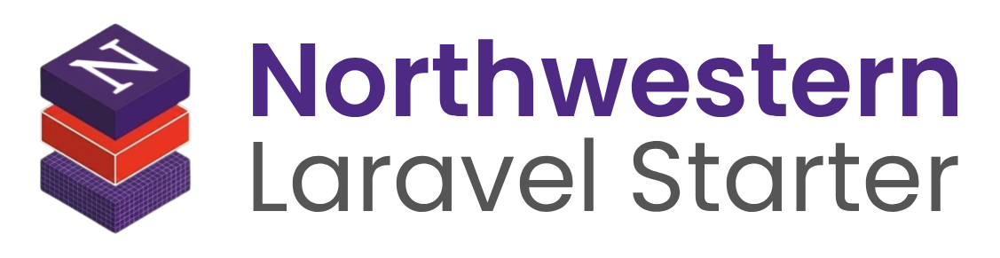
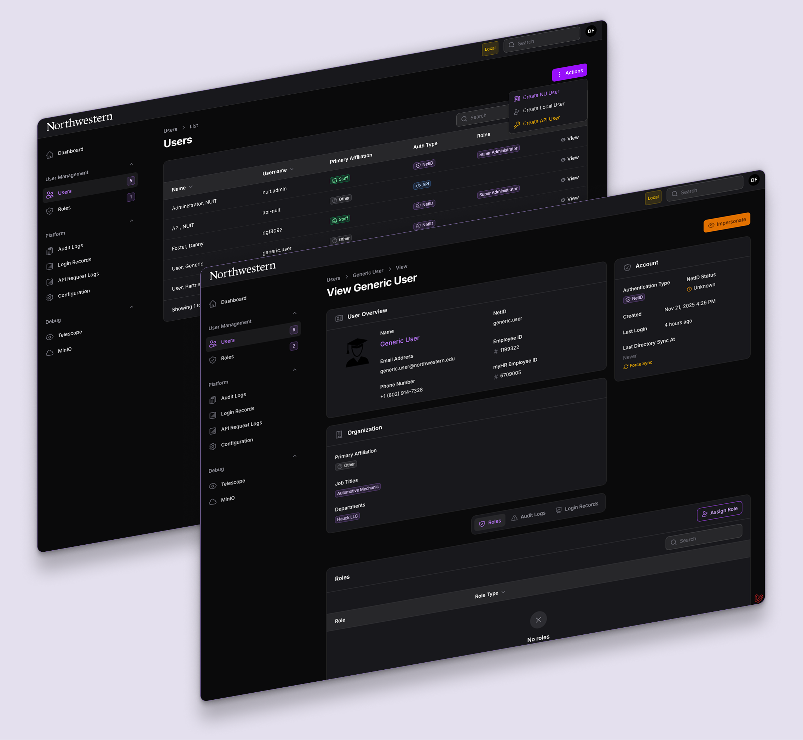
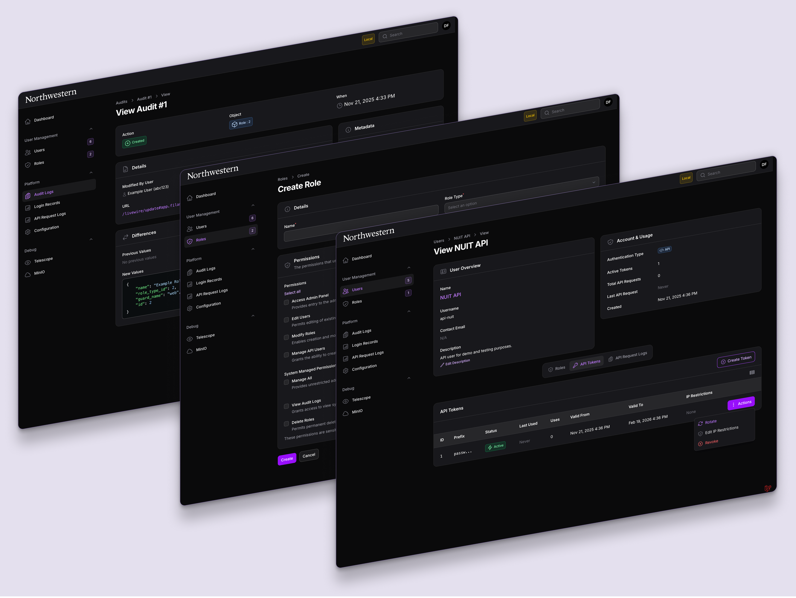
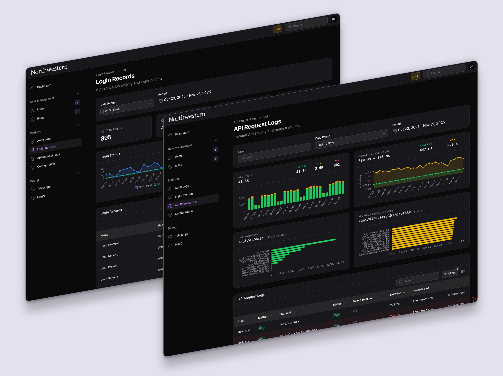

    <picture>
        <source
            width="650px"
            media="(prefers-color-scheme: dark)"
            srcset="art/readme-lockup-dark.png"
        >      
        
    </picture>

A robust, enterprise-ready Laravel starter kit tailored specifically for [Northwestern University](https://www.northwestern.edu/) projects. This opinionated project provides everything you need to build secure, scalable, and maintainable web applications or fully API-driven services.

  <table>
    <tr>
      <td align="center">
        
      </td>
      <td align="center">
        
      </td>
    </tr>
    <tr>
      <td align="center">
        
      </td>
      <td align="center">
        
      </td>
    </tr>
  </table>

## ✨ Features

### 🏗️ Architectural Foundation
- **Domain-Driven Design**: Code is logically grouped by business concerns for enhanced modularity and maintainability.
- **Action-Based Business Logic**: Single-responsibility action classes encapsulate discrete operations for reusability and testability.
- **Flexible Configuration**: Fine-grained settings for authentication methods, API features, Northwestern integrations, and application behavior.

### 🔐 Authentication & Authorization
- **Multi-Authentication Methods**: Support for Entra ID SSO, API tokens, and passwordless email-based login links.
- **Role-Based Access Control**: Fine-grained role and permissions system managed through an intuitive interface.
- **User Impersonation**: Secure ability to troubleshoot user-specific issues and simulate user experiences.

### 🔌 API Features
- **Advanced API Token Management**: Cryptographically secure tokens with CIDR-based IP restrictions, rotation, time-bound validity, and automatic expiration notifications.
- **API Request Logging & Analytics**: Comprehensive request tracking with performance metrics, failure analysis, and probabilistic sampling.
- **Request Tracing**: Automatic trace ID propagation for correlation across logs, audits, and error reports.
- **Standardized Error Responses**: [RFC 9457](https://www.rfc-editor.org/rfc/rfc9457.html) compliant machine-readable error response formats.

### 📊 Auditing & Compliance
- **Full Audit Trail**: Automatically logs all model changes and user actions with a complete before/after history.
- **Secure Data Handling**: Sensitive information is properly hashed or encrypted to limit the risk of data exposure.

### 🎓 Northwestern Integrations
- **Northwestern Directory**: Just-in-time user provisioning, automatic data synchronization, and monitoring with the Northwestern Directory service.
- **EventHub**: Seamless integration for publishing events or registering webhooks with the EventHub system.

### 🎨 Frontend & UX
- **Modular Filament UI**: Ready-to-use administration panel with pre-built tables, forms, and dashboards for managing application data.
- **Brand Compliance**: Pre-built components, layouts, and styling that adhere to the University's branding guidelines.
- **Responsive Design**: Consistent user experience across devices with various screen sizes.
- **WCAG 2.1 Accessibility**: Built with accessibility best practices to ensure inclusivity for all users.

### 🧑‍💻 Developer Experience
- **Streamlined Local Development**: Schema-validated database snapshots, configuration validation, and database rebuild utilities.
- **High-Performance Testing**: Parallelized PHPUnit execution and end-to-end testing with [Cypress](https://www.cypress.io).
- **CI/CD Ready**: Pre-configured GitHub Actions workflows for static analysis, formatting, and automated testing. 

### 📈 Monitoring & Operations
- **Health Checks & Monitoring**: Built-in health checks to monitor critical system components.
- **Analytics Dashboards**: Pre-built dashboards for API request metrics and login activity.

## 📋 System Requirements

- [PHP](https://www.php.net/) `^8.4`
- [Node.js](https://nodejs.org/en) `v24.x`
- [pnpm](https://pnpm.io/installation) `^10.0`

## 🚀 Getting Started

Visit the [documentation](laravel-starter.entapp.northwestern.edu) for complete installation, configuration, and usage guides.

## 🤝 Acknowledgements

This starter kit is built upon the contributions of numerous open-source packages. Special thanks to the Laravel community and [Northwestern University IT](https://www.it.northwestern.edu) for making this project possible.
