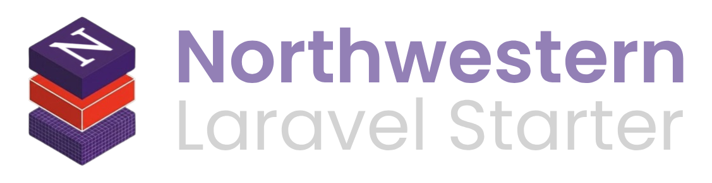
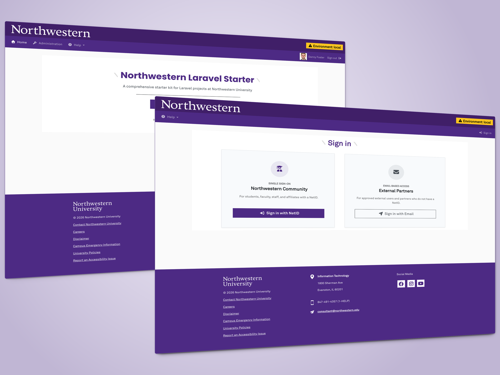
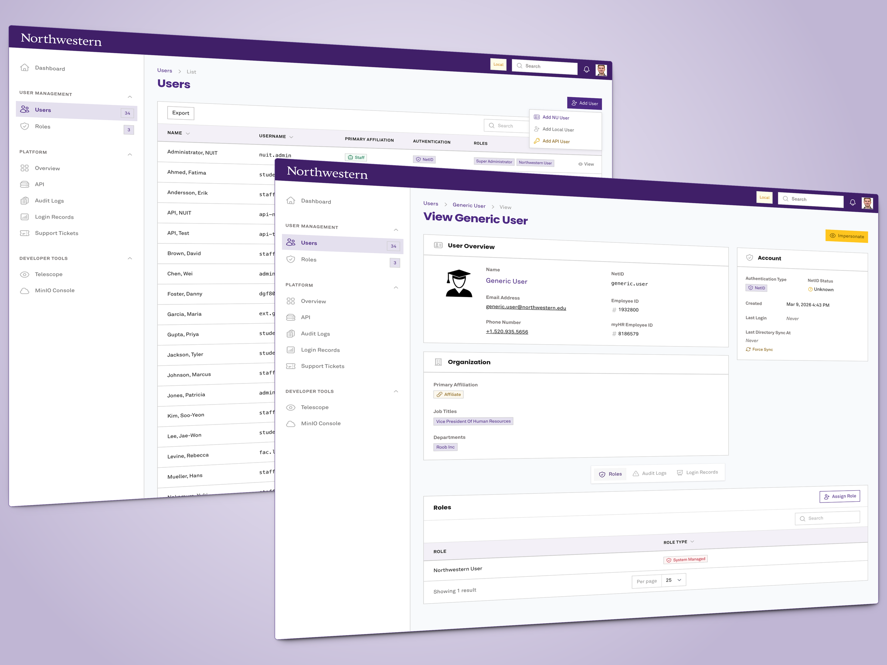
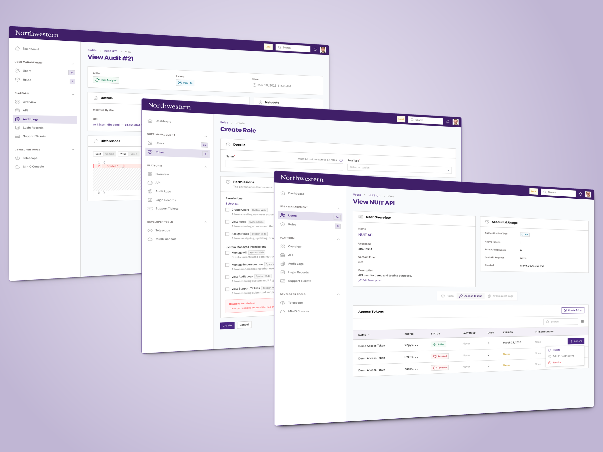
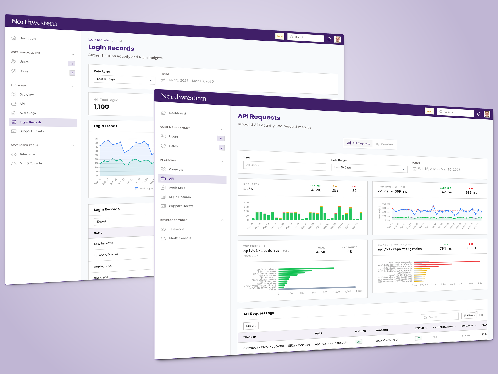

<p align="center">
    
</p>

<p align="center">
    
    
    <a href="https://coveralls.io/github/NIT-Administrative-Systems/northwestern-laravel-starter?branch=main"></a>
</p>

<hr/>

<div align="center">
  <p>An enterprise-focused Laravel starter kit for <a href="https://www.northwestern.edu" target="_blank">Northwestern University</a> projects. This opinionated project provides what you need to build secure, maintainable web applications or API-driven services.</p>

  <table>
    <tr>
      <td align="center">
        <a href="art/ui-preview-1.png" target="_blank">
          
        </a>
      </td>
      <td align="center">
        <a href="art/ui-preview-2.png" target="_blank">
          
        </a>
      </td>
    </tr>
    <tr>
      <td align="center">
        <a href="art/ui-preview-3.png" target="_blank">
          
        </a>
      </td>
      <td align="center">
        <a href="art/ui-preview-4.png" target="_blank">
          
        </a>
      </td>
    </tr>
  </table>
</div>

## Overview

Modern web development extends beyond routes, controllers, and views. Before any business logic can take shape, teams must establish authentication flows, authorization layers, API conventions, auditing, CI/CD pipelines, frontend patterns, monitoring, and a maintainable project structure. These concerns take time and lead to duplicated effort across projects.

The **Northwestern Laravel Starter** handles this baseline work up front with a production-ready architecture, so teams can start building features instead of infrastructure.

> [!IMPORTANT]
>
> This starter kit is designed primarily for applications built within [Northwestern University](https://www.northwestern.edu)’s ecosystem. If you're outside Northwestern, you may not be able to use the project as-is. The architecture and patterns may still be useful as reference material. Contributions from the community are welcome.

## Getting Started

```bash
composer create-project northwestern-sysdev/northwestern-laravel-starter your-project-name
cd your-project-name
```

Visit the [documentation](https://laravel-starter.entapp.northwestern.edu) for complete installation, configuration, and
usage guides.

## Features

### Architectural Foundation

- **Domain-Driven Design**: Code is grouped by business concerns for modularity and maintainability.
- **Action-Based Business Logic**: Single-responsibility action classes encapsulate discrete operations for reusability
  and testability.
- **Flexible Configuration**: Fine-grained settings for authentication methods, API features, Northwestern integrations,
  and application behavior.

### Authentication & Authorization

- **Multi-Authentication Methods**: Support for Entra ID SSO, Access Tokens, and passwordless email-based verification codes.
- **Role-Based Access Control**: Fine-grained role and permissions system with a built-in management interface.
- **User Impersonation**: Secure ability to troubleshoot user-specific issues and simulate user experiences.

### API Features

- **Advanced Access Token Management**: Cryptographically secure tokens with CIDR-based IP restrictions, rotation,
  time-bound validity, and automatic expiration notifications.
- **API Request Logging & Analytics**: Request tracking with performance metrics, failure analysis, and
  probabilistic sampling.
- **Request Tracing**: Automatic trace ID propagation for correlation across logs, audits, and error reports.
- **Standardized Error Responses**: [RFC 9457](https://www.rfc-editor.org/rfc/rfc9457.html) compliant machine-readable
  error response formats.

### Auditing & Compliance

- **Full Audit Trail**: Logs all model changes and user actions with before/after history.
- **Secure Data Handling**: Sensitive information is hashed or encrypted to limit data exposure risk.

### Northwestern Integrations

- **Northwestern Directory**: Just-in-time user provisioning, automatic data synchronization, and monitoring via the
  Northwestern Directory service.
- **EventHub**: Publish events and register webhooks with the EventHub system.

### Frontend & UX

- **Modular Filament UI**: Ready-to-use administration panel with pre-built tables, forms, and dashboards for managing
  application data.
- **Brand Compliance**: Pre-built components, layouts, and styling that adhere to the University's branding guidelines.
- **Responsive Design**: Consistent user experience across devices with various screen sizes.
- **WCAG 2.1 Accessibility**: Built with accessibility best practices.

### Developer Experience

- **Local Development**: Schema-validated database snapshots, configuration validation, and database rebuild
  utilities.
- **Testing**: Parallelized PHPUnit execution and end-to-end testing
  with [Cypress](https://www.cypress.io).
- **CI/CD Ready**: Pre-configured GitHub Actions workflows for static analysis, formatting, and automated testing.

### Monitoring & Operations

- **Health Checks & Monitoring**: Built-in health checks to monitor critical system components.
- **Analytics Dashboards**: Pre-built dashboards for API request metrics and login activity.

## Acknowledgements

Numerous open-source packages power this starter kit. Special thanks to the Laravel community and [Northwestern University IT](https://www.it.northwestern.edu).
