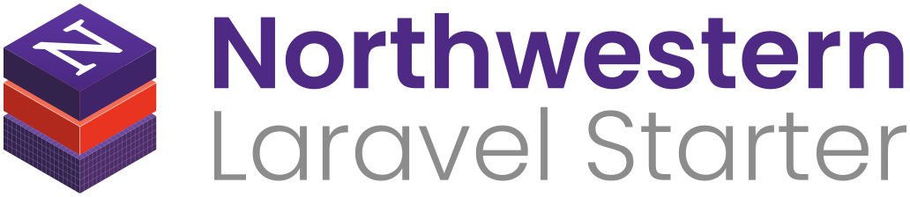
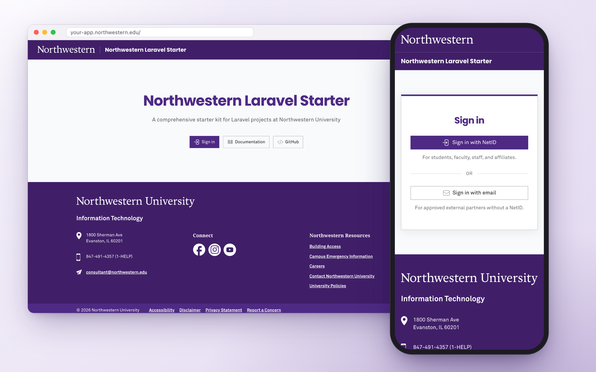
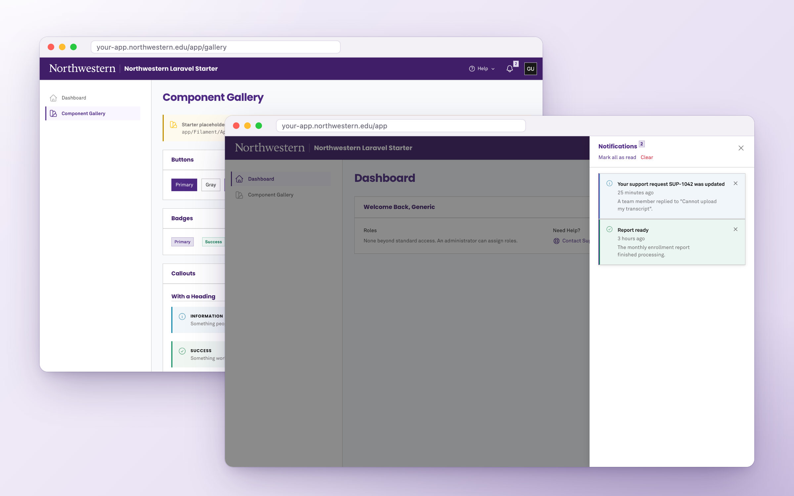
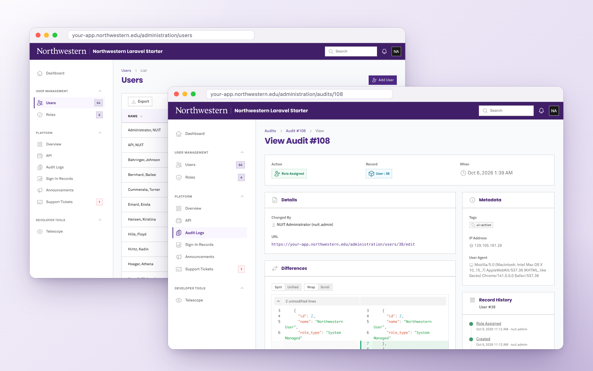
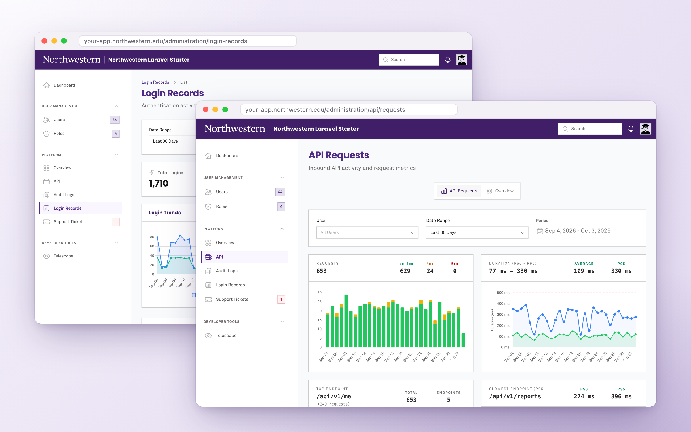

<p align="center">
    <picture>
        <source media="(prefers-color-scheme: dark)" srcset="art/lockup-dark.svg">
        
    </picture>
</p>

<p align="center">
    <a href="https://laravel-starter.entapp.northwestern.edu"></a>
    
    
    
    <a href="https://coveralls.io/github/NIT-Administrative-Systems/northwestern-laravel-starter?branch=main"></a>
</p>

<p align="center">
    A Laravel starter kit for <a href="https://www.northwestern.edu">Northwestern University</a> applications, with Northwestern sign-in, roles and permissions, auditing, an OAuth-secured API and the University's branding built in.
</p>

<p align="center">
    <a href="https://laravel-starter.entapp.northwestern.edu"><strong>Documentation</strong></a>
    &nbsp;·&nbsp;
    <a href="https://laravel-starter.entapp.northwestern.edu/getting-started/installation/">Installation</a>
    &nbsp;·&nbsp;
    <a href="CHANGELOG.md">Changelog</a>
</p>

<table>
    <tr>
        <td align="center">
            <a href="art/ui-preview-1.png"></a>
        </td>
        <td align="center">
            <a href="art/ui-preview-2.png"></a>
        </td>
    </tr>
    <tr>
        <td align="center">
            <a href="art/ui-preview-3.png"></a>
        </td>
        <td align="center">
            <a href="art/ui-preview-4.png"></a>
        </td>
    </tr>
</table>

## Overview

Every application needs the same groundwork before it can do anything of its own: sign-in, permissions, auditing, an API, CI, monitoring, and a structure that holds up as it grows. Rebuilding it for each project takes time away from the work that matters, and every team ends up with a slightly different version.

The starter builds it once, tested and documented, so your team starts with the work that's specific to your application.

> [!IMPORTANT]
> The starter is built for applications inside [Northwestern University](https://www.northwestern.edu)'s environment: its sign-in and integrations rely on University services. Outside Northwestern, you can still borrow its architecture and patterns.

## Getting Started

```bash
composer create-project northwestern-sysdev/northwestern-laravel-starter your-project-name
cd your-project-name
```

Then follow the [installation guide](https://laravel-starter.entapp.northwestern.edu/getting-started/installation/) to configure your environment and run the application. The [documentation](https://laravel-starter.entapp.northwestern.edu) covers everything below in full.

## What's Included

### Northwestern Integrations

- **[Single sign-on](https://laravel-starter.entapp.northwestern.edu/northwestern-integrations/websso/)**: NetID sign-in through Online Passport (WebSSO) or Entra ID.
- **[Directory Search](https://laravel-starter.entapp.northwestern.edu/northwestern-integrations/directory-search/)**: Accounts created on first sign-in and kept in sync with the Northwestern Directory.
- **[Wildcard photos](https://laravel-starter.entapp.northwestern.edu/northwestern-integrations/wildcard-photos/)**: People's ID photos, cached.
- **[EventHub](https://laravel-starter.entapp.northwestern.edu/northwestern-integrations/eventhub/)**: Publish events, and receive them through webhooks.

### Access and Accountability

- **[Sign-in](https://laravel-starter.entapp.northwestern.edu/features/authentication/)**: Single sign-on, emailed codes for partners without a NetID, and impersonation for troubleshooting.
- **[Roles and permissions](https://laravel-starter.entapp.northwestern.edu/features/authorization/)**: Managed in the administration panel, with a history of every change.
- **[Audit trail](https://laravel-starter.entapp.northwestern.edu/features/audit-logging/)**: Changes to your models, and every role, permission and credential event, with the values before and after.
- **[Data retention](https://laravel-starter.entapp.northwestern.edu/getting-started/initial-customization/#7-data-retention)**: A retention period for each kind of record, with older records pruned daily.

### API and AI Clients

- **[OAuth credentials](https://laravel-starter.entapp.northwestern.edu/features/api/)**: Service clients for integrations, personal access tokens, and applications people connect through a consent screen, all on Laravel Passport.
- **[MCP server](https://laravel-starter.entapp.northwestern.edu/features/mcp/)**: AI clients such as Claude and VS Code use your application's tools as the person who connected them.
- **[Operations](https://laravel-starter.entapp.northwestern.edu/features/api-operations/)**: Request logs and analytics, trace IDs across logs, audits and errors, and [RFC 9457](https://www.rfc-editor.org/rfc/rfc9457.html) error responses.

### Interface

- **[Two Filament panels](https://laravel-starter.entapp.northwestern.edu/architecture/ui-architecture/)**: An app panel for your application's features, and an administration panel for users, roles, credentials, audits and analytics.
- **[Public pages](https://laravel-starter.entapp.northwestern.edu/building/public-pages/)**: A landing page, a public changelog, and branded error pages.
- **[Announcements](https://laravel-starter.entapp.northwestern.edu/features/announcements/)** and **[Contact Support](https://laravel-starter.entapp.northwestern.edu/features/support-tickets/)**: Tell people what's changing, and take their requests as TeamDynamix tickets or email.
- **[Northwestern branding](https://laravel-starter.entapp.northwestern.edu/building/branding-and-mail/)**: Themed to the University's guidelines, with the unit footer the Web Style Guide requires.
- **[Accessibility](https://laravel-starter.entapp.northwestern.edu/guides/testing/)**: Every page the starter ships is checked with axe, in light and dark mode.

### Developer Experience

- **[Domain-driven structure](https://laravel-starter.entapp.northwestern.edu/architecture/domain-driven-design/)**: Code grouped by business domain, with single-purpose action classes.
- **[Local development](https://laravel-starter.entapp.northwestern.edu/guides/development-workflow/)**: One-click sign-in as seeded users, database snapshots and rebuilds, and configuration validation.
- **[Testing and CI](https://laravel-starter.entapp.northwestern.edu/guides/testing/)**: Parallel [Pest](https://pestphp.com) tests, browser tests through [Playwright](https://playwright.dev), and GitHub Actions for analysis, formatting and tests.
- **[Monitoring](https://laravel-starter.entapp.northwestern.edu/features/health-checks/)**: Health checks, [Sentry](https://laravel-starter.entapp.northwestern.edu/features/sentry/) error reporting, and Laravel Telescope.

## Acknowledgements

Built on [Laravel](https://laravel.com), [Filament](https://filamentphp.com) and many other open-source packages. Thanks to the Laravel community and [Northwestern University IT](https://www.it.northwestern.edu).
